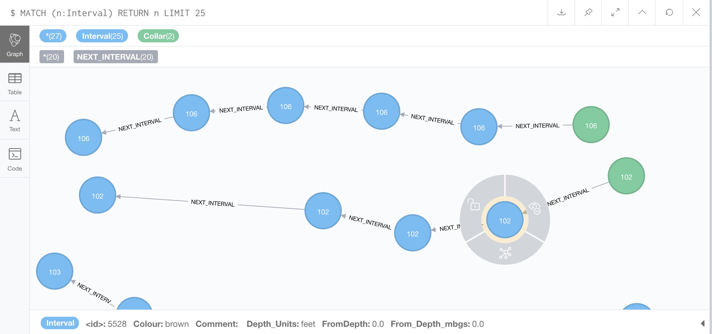
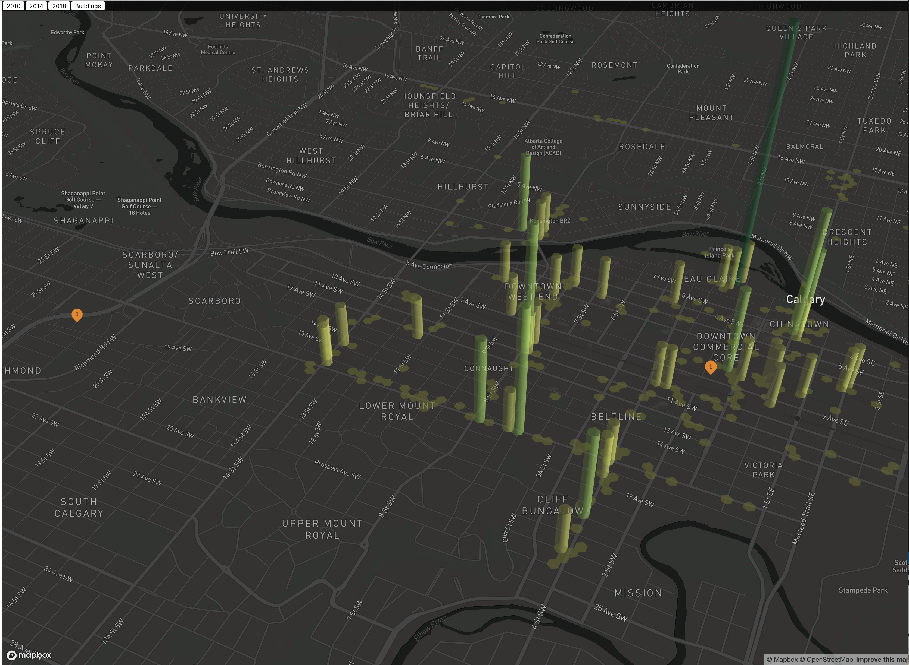

# Menome Technologies Presents Spatial Experiments with Neo4j - Now featuring GraphXR 3d Visualizations!

Greetings!  I have a long career in working with spatial data. This covers the range of standard GIS (ESRI and Geoserver, 3d modelling for mining operations, complex geological modelling, buildings and structures, finite element and numerical analysis.

So it was incredibly exciting when Neo4j first introduced spatial capabilities. While these are currently limited compared to what something like ESRI offers in terms of standard GIS analysis such as buffering etc., the fact that neo4j supports both 3d spatial and 3d cartesian coordinates opens up a whole realm of possibilities that will ultimately transcend what a typical GIS can do.

This is because neo4j due to its graph model of nodes and relationships when combined with being able to assign 3d spatial and Cartesian coordinates to nodes becomes both a GIS and what runs behind most CAD and numerical models. Standard CAD and GIS systems use tabular data structures that are converted to graph structures in memory to do their work. Generally the data aspect and the structural/spatial/3d aspects are stored in separate table structures. Autocad and Revit actually use completely separate data and structural data stores to model buildings and other complex 3d objects.

Neo4j with its spatial capabilities now makes it possible to actually fully combine the 3d structure, spatial structure and data into a single model. It also being a graph database then has all the power that affords, plus the text analytics, Lucene full text engine and AI/ML libraries. This suddenly means that it becomes possible to model spatial surface models such as Open Street Maps, but the buildings on those maps, the boreholes and subsurface data that make up geological or geotechnical data, and all of the reports, design documents and other structured and unstructured data that are associated with any complex engineering structure.

This has the potential to be incredibly powerful and very disruptive to the world of engineering and geology. 

My goal with these spatial experimentes is to explore using small,focused mini-projects the range of possiblities to validate how far I can take the spatial capabilities of neo4j.

## Experiement 2 - Subsurface data - Modelling boreholes with Neo4j

One of the disruptive aspects of Neo4j is that the graph modelling approach makes it possible to model not just the data, but also the structure of the data as it would be in the real world. 

This is a powerful enabler for geoscience related appliations for environmental, geotechnical, geological and geophysical data. Historically, these types of data require modelling the structural aspects such as the shape and location of an orebody, boreholes, environmental receptors, engineered structures and the data associated with those structures using multiple approaches and multiple systems. 

Neo4j has both cartesian and spatial capabilities, and because most structural modelling approaches in the geosciences use meshes or linked lists to model data, Neo4j is very well suited to these use cases. 

Further - Neo4j offers the potnetial to not only model the structures and data that compose those structures, but all adjacent and associated data in a single repository. It also offers powerful tools such as graph algorithms, natural language processing and the ability to factor in all decisions and versions of decisions made to develop a conceptual model of a complex site. 

We at Menome Technologies feel that Neo4j has the potential to have a major impact on the world of geology and engineering, and we are working hard to use our team's domain expertise in environmental, oil and gas, engineering, geology and AEC to explore applying Neo4j's capabilities to the world of Geology and Engineering. 

It seemed appropriate therefore to focus the second post in our series of Neo4j Spatial Experiements on modelling borehole data with Neo4j. 

## Modelling Boreholes With Neo4j

Boreholes area foundational aspect of many forms of geological model. Boreholes are a powerful tool for understanding what is below the surface of the ground, and are used in many forms of geological modelling:

- Soil Characterization to understand the structural aspects of the ground for engineering, environmental or geotechnical work (foundation design, )
- Groundwater modelling: Locating subsurface water resources for water wells or other uses
- Contaminate Detection: finding where spilled hazardous materials are located (salt, hydrocarbons etc.)
- Remediation: removing contaminates by pumping contaminated water out of the ground and treating it
- Mining Exploration: deep hardrock boreholes that are logged to locate metals such as gold, silver, zink, copper etc.
- Petroleum Geology: the now well known fracking technique relies on directed drilling of boreholes

All of these types of boreholes are well suited to being modelled with Neo4j. 

To keep things simple though for this example I have chosen what is known as a Lithological soil classification borehole. These boreholes are reletively shallow and drilled into soil. The soil is logged using a standard classification method to identify key layers of soil. 

The logs are used to delimit soil intervals down the hole. For example, a hole might contain 3 meters of Till, 1 meter of sand, 2 meters of boulders and then bedrock. The next hole beside it might have 3 meters of till, 2 meters of boulders, then bedrock. In this example, when the geologist interprets the two holes, the like material intervals are connected between the holes. The sand 'pinches out' somewhere between the two holes. This forms the basis of a simple geological model of the material beneth the ground. 

For this example, we will do the first part of the process: taking the data from a set of borehole logs, and generating borehole intervals of linked lists in Neo4j. 

### Geology Data Visualization

While Modelling geological data is a big part of the equation of developing a geological model, being able to effectively visualize and work with the geological model is crucial.

We were very excited therefore when we saw what [Kineviz](https://www.kineviz.com)  had developed with the GraphXR tool. I reached out to the Kineviz team following the presentation they did on GraphXR in the Neo4j Developer community. 

The Kineviz team have been great to collaborate with and have taking the borehole model example, and projected it into GraphXR. With their help, we were able to create a 3d visualizaiton of the borehole data that is spatially accurate. GraphXR gives the ability to see the different layers, and manipulate the data set as well. 

Details for this example including data, import CQL scripts and transforms required to generate borehole linked lists are located in the following GitHub Repo: 

[Borehole Example Github Repository:](https://github.com/menome/neo4j-spatial-experiments/tree/master/2_boreholes)

You can check out the final visualization here, but its more rewarding if you build er from scratch!
[Borehole Example GraphXR 3d Viz](https://graphxr.kineviz.com/share/5cd36d001eb32e0067057519/Borehole/5cd36db11eb32e006705751c)

## Experiment 1 - Walkscore computation using Neo4j

The first experiement was to take Open Street Map data and see if I could construct a basic spatial analysis using Neo4j. For this experiement I chose to pursue replicating the Walk Score algortihm. I did this because it is a well known, published algorithm that I could validate my work against. 

The Walk Score example is documented and stored in 1_walkscore directory. A further experiement will seek to imporve and replace the base Walk Score algorithm using Graph Techniques for calculating actual distance instead of linear distance to assess features, and will combine the Yelp ratings scores data to factor in amenity quality as part of the rank. 

[Read about Walkscore Here](./1_walkscore/readme.md)

## Stay Tuned for more Geological Examples!

We will plan a follow up example as the next in our series on spatial experiements using Neo4j that will take interpreting geological data and constructing modles of the environment around us futher, so stay tuned!

### More details on Kineviz GraphXR:

Kineviz develops visual analytics software and solutions. Kineviz's GraphXR platform offers unprecedented speed, power, and ease of use for deriving insight from sources such as geospatial, time series, rich documents, financial transactions, and social media data. For technical users, it's a highly flexible and extensible environment for conducting ad hoc analysis. For business users, it's a start-to-finish tool for intuitive, code-free investigation.

Collect data from Relational and Graph databases, CSVs, and Json. 
Cleanse and enrich with built-in tools as well as API calls. 
Analyze links, properties, time series, and spatial data within a unified, animated context. 

Save back to Neo4j, output as a report, or embed in your webpage. 
GraphXR supports a wide range of applications including law enforcement, medical research, and knowledge management.  

[Kineviz GraphXR](https://www.kineviz.com/graphxr)

### More details on Menome Technologies:

Menome Technologies Inc -> Imagine What You Could Know….

Menome Technologies has invented breakthrough data refinement, data management, and AI-based analytical solutions to provide data-driven organizations with unprecedented visibility and contextual understanding of their corporation’s entire set of knowledge assets.  

Information that was previously inaccessible – historic information, reports, PDFs, presentations, and articles – can be seamlessly integrated with all other corporate information for more accurate decision-making.

At mining, energy, and environmental companies, Menome integrates field telemetry, environmental assessments, historical reports, risk assessments, and project data.

Using these Menome powerful proprietary machine-based-learning tools to identify hidden data structures and identify and uncover trends, to provide the richest and most accurate understanding of the impacts of key decision alternatives. 

Decisions based on holistic data knowledges are more likely to drive productivity, reduce risk, and generation profits. 

[Menome Technologies Inc.](https://www.menome.com)
